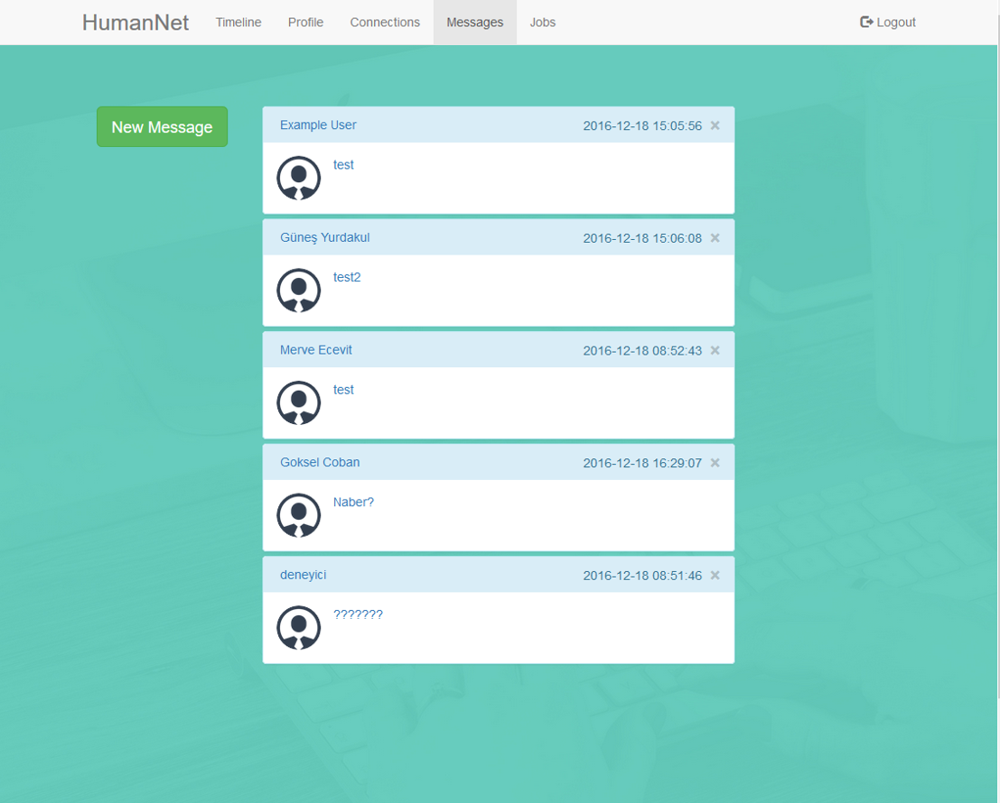
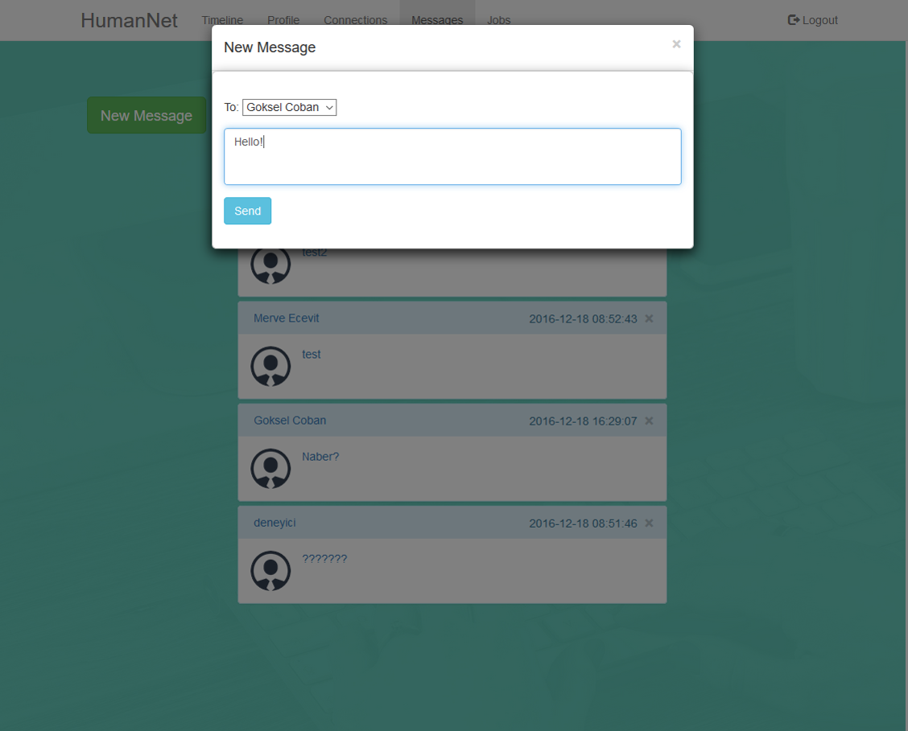
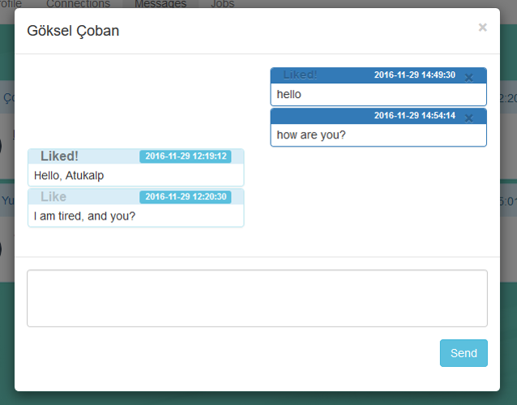
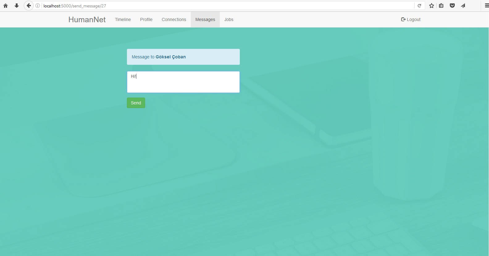

Parts Implemented by Kaan ATUKALP
================================

**Inbox**

Upon entering the messages page, the message inbox of the user is displayed as below.

* Chats can be deleted by clicking "x" at the righmost corner of the chat box.

**Sending a New Message**

Users can compose a new message by clicking the "New Message" button and choose whom to send from the selection box. 

* The selection box contains the users the user is following.

**Chats**

Each chat is diplayed in a modal.

* Users can send messages by using the textarea.
* A message can be like by clicking "Like" on message boxes.
* A liked message can be unliked by clicking the appearing "Liked!" text.
* If the participant has liked a message of the user, a "Liked!" text will appear on the message box.
* A single message can be deleted by clicking "x" at the rightmost corner of the message box.

**Sending a Single Message (Parametric Page)**

This page can be accessed by clicking the message button in profile pages or in the connections page. Allows the user to send a single message to any user.

